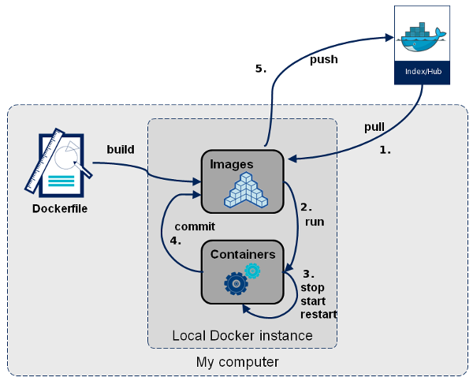
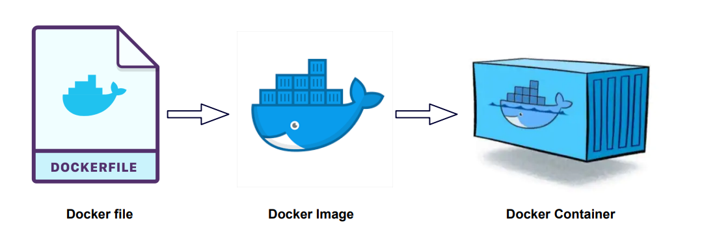
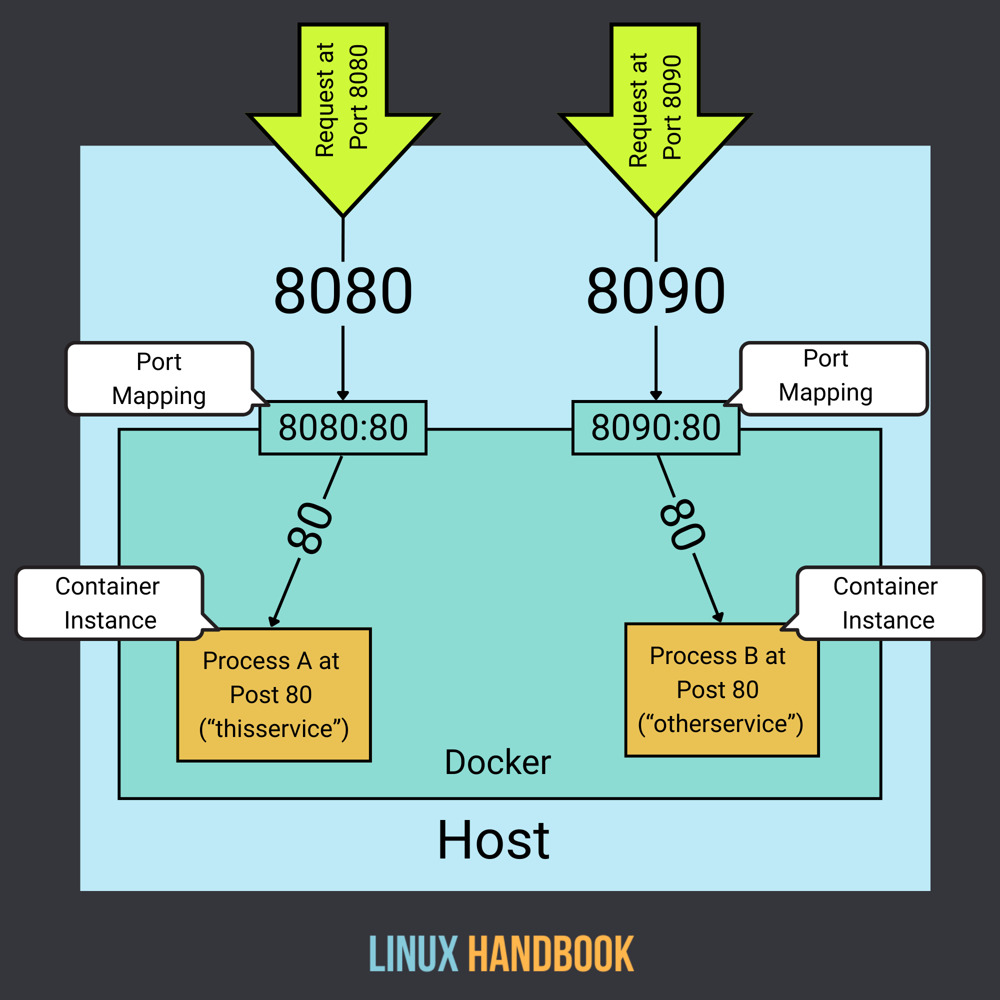

# Docker Workshop 101



## 概念

### 工程師只關注兩個面向
- `Development` 和 `Operation`
- Docker 解決 `Operation` 痛點

### 三個基本單元
`Dockerfile`、`Image`、`Container`



1. **Dockerfile** - 自動化腳本
2. **Image** - 虛擬機的鏡照
3. **Container** - 啟用的 `image`

### 問題
- 那數據中台的 `Pod` 和 `Container` 之間的差異是什麼？

---

## Level 0: 前置作業
- Install docker: https://www.docker.com/get-started/
- Install postman: https://www.postman.com/

### 實作題：

1. 執行 `docker --version` 成功
2. 執行 `docker run hello-world` 確認環境正常

---

## Level 1: 會啟用別人包好的 image

### DockerHub 拉取映像檔
- `docker pull <image>`
  - [DockerHub](https://hub.docker.com/)
  - image:tag
  - https://hub.docker.com/_/python

### 執行容器(啟用image)
```
# 一般執行
docker run <image>

# -d: 背景執行
docker run -d <image> 

# --rm: Container 停止後會自動刪除
docker run --rm <image>

## --name: Container 命名
docker run --name my-container <image>

# --restart: 容器的重啟策略（如 no、on-failure、always、unless-stopped）
docker run --restart always <image>

# Port mapping
docker run -p 8080:80 <image>
```



### 查看與管理

```
# 顯示正在運行的容器
docker ps

# 列出所有容器(包括停止的容器)
docker ps -a

# 查看目前系統裡所擁有的 image
docker images
```

### 容器控制

```
docker start
docker stop
docker restart
docker stats
```

### 刪除指令

```
# 刪除指令
docker rm <container_id>      # 刪除容器
docker rmi <image_id>         # 刪除映像檔
docker system prune           # 清理未使用的資源(務必謹慎使用)
```

### 實作題：

1. 練習打包 `/demo-2/` 內的程式碼

---

## Level 2：會打包自己包的服務，並會啟動服務

### 建置映像檔
- `docker build`

### 執行與參數
- `docker run` & 參數

### 查看日誌
- `docker logs`
- 如何觀察上數據中台的服務，如何判斷是否服務正常運行？

### 進入容器

- 如何進入已經啟用的服務？
```
docker exec -it /bin/bash
```

---

## Level 3：怎麼更聰明的打包

### Dockerfile 範例
```
FROM python:3.9

WORKDIR /app

COPY requirements.txt .

RUN pip install -r requirements.txt

COPY . .

# CMD:  當 DOCKER 容器起來之後要執行的命令, 和 RUN 差異是 RUN 是在創建當下執行
CMD ["python", "app.py"]
```

### 其他注意事項
- Images 能夠被反組譯, 別放機敏資料

  可以的話把機敏資料在啟動 Container 時再用 -e 參數注入

- Dockerfile 層數和 Image 容量大小相關

- <contanier_id> 和 <image_id> 可以用前三碼操作，效果相同。

### 實作題：

1. 練習打包 `/demo-3/` 內的程式碼並啟用服務
2. 用 `postman` 打該服務

---

## Level 4
- docker compose
- k8s


### 實作題：

1. 練習透過 docker compose 啟用 `/demo-4/`

---

## 參考資料
- Docker 10分鐘速速入門: http://youtube.com/watch?v=mPquwpxwVAU
- https://www.runoob.com/docker/docker-run-command.html